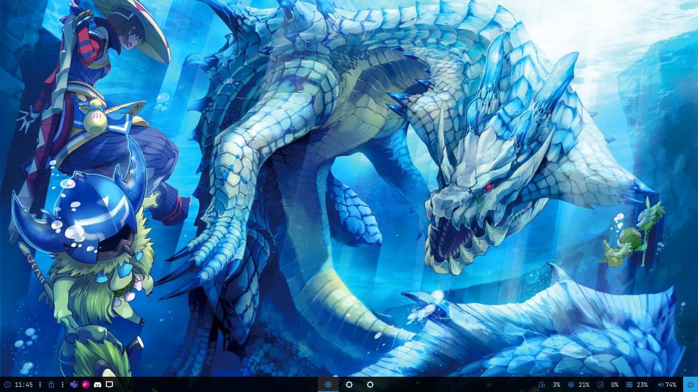

# Bars
Here are some bar configurations that i like a lot!

## [Polybar](https://github.com/polybar/polybar) 

## [Eww](https://github.com/elkowar/eww)

Similar to polybar but with a lot more stuff (and a dashboard!)

## Acknowledgements

When doing this project I looked up to [rxyhn](https://github.com/rxyhn/bspdots) and [adi1090x](https://github.com/adi1090x/widgets) for inspiration (and a good look at the [docs](https://elkowar.github.io/eww/))

Thank you [Luiz](https://github.com/luizschonarth) - for the suggestions and feedback <3!